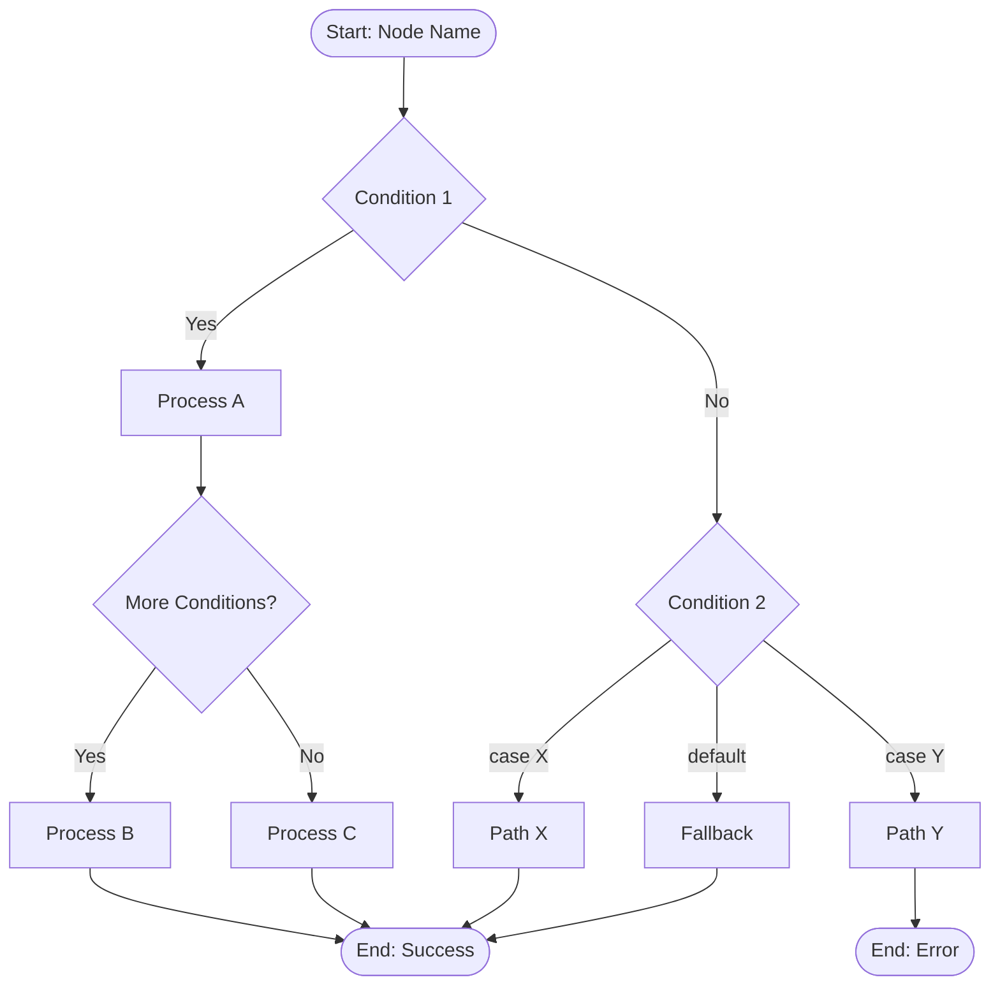

```mermaid
flowchart TD
    A([Start: Node Name]) --> B{Condition 1}

    B -- Yes --> C[Process A]
    B -- No --> D{Condition 2}

    C --> E{More Conditions?}
    E -- Yes --> F[Process B]
    E -- No --> G[Process C]

    D -- case X --> H[Path X]
    D -- case Y --> I[Path Y]
    D -- default --> J[Fallback]

    F --> K([End: Success])
    G --> K
    H --> K
    I --> L([End: Error])
    J --> K
```
